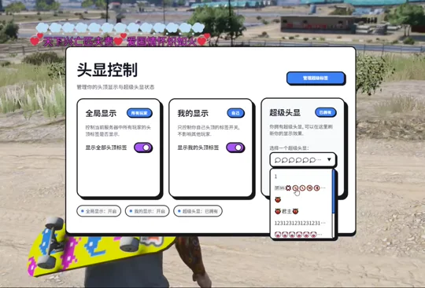

<!-- PROJECT LOGO -->
<br />
<div align="center">
  <h1 align="center">🏷️ dy_name_tag</h1>

  <p align="center">
    一款功能丰富、高性能的 FiveM 玩家头顶名牌系统，支持多框架、自定义标签与 NUI 管理界面。
    <br />
    <br />
    <a href="https://github.com/DyroS3/dy_name_tag/issues">报告 Bug</a>
    ·
    <a href="https://github.com/DyroS3/dy_name_tag/issues">提出新特性</a>
  </p>
</div>

<!-- BADGES -->
<div align="center">
    
    
    
    
</div>

---

<!-- TABLE OF CONTENTS -->
<details>
  <summary>📑 目录</summary>
  <ol>
    <li><a href="#关于项目">关于项目</a></li>
    <li><a href="#功能特性">功能特性</a></li>
    <li><a href="#演示截图">演示截图</a></li>
    <li>
      <a href="#快速开始">快速开始</a>
      <ul>
        <li><a href="#环境依赖">环境依赖</a></li>
        <li><a href="#安装步骤">安装步骤</a></li>
      </ul>
    </li>
    <li><a href="#配置说明">配置说明</a></li>
    <li><a href="#使用方法">使用方法</a></li>
    <li><a href="#文件结构">文件结构</a></li>
    <li><a href="#路线图">路线图</a></li>
    <li><a href="#贡献指南">贡献指南</a></li>
    <li><a href="#许可证">许可证</a></li>
  </ol>
</details>

---

## 关于项目

**dy_name_tag** 是一款专为 FiveM 服务器设计的玩家头顶名牌显示系统。它能在玩家头顶实时渲染多行信息，包括玩家ID、角色名、职业职称、VIP标签以及可自定义的超级标签。

本资源采用零内存分配的高性能渲染架构，支持动态流控与自适应刷新，确保在高玩家密度场景下依然流畅运行。

### 技术栈

- **Lua 5.4** - 核心脚本语言
- **ox_lib** - 通用工具库
- **oxmysql** - 数据库交互
- **Vue 3** - NUI 界面框架

---

## 功能特性

- ✅ **多框架支持** - 兼容 ESX / QBCore / Standalone
- ✅ **多行头顶显示** - 支持名字、职业、VIP标签、超级标签四行显示
- ✅ **职业颜色系统** - 根据职业自动匹配名牌颜色
- ✅ **VIP 标签系统** - 为特定玩家配置专属头顶标签
- ✅ **超级标签系统** - 玩家可拥有多个标签并自由切换，数据持久化存储
- ✅ **新玩家标识** - 自动为新玩家显示特殊图标 (🆕)
- ✅ **隐藏区域** - 配置特定区域内不显示头顶名牌
- ✅ **NUI 管理界面** - 美观的 Vue 3 界面，支持玩家自助切换标签
- ✅ **管理员功能** - 管理员可为任意玩家添加/删除/设置超级标签
- ✅ **高性能渲染** - 零内存分配设计，动态流控，自适应刷新间隔
- ✅ **多语言支持** - 内置中文/英文本地化

---

## 演示截图



---

## 快速开始

### 环境依赖

- [ox_lib](https://github.com/overextended/ox_lib) - 必需
- [oxmysql](https://github.com/overextended/oxmysql) - 必需（用于超级标签持久化）
- ESX / QBCore 框架（可选，支持 Standalone 模式）

### 安装步骤

1. **下载资源**
   ```sh
   git clone https://github.com/DyroS3/dy_name_tag.git
   ```

2. **导入数据库**
   ```sh
   # 在你的数据库中执行 sql/install.sql
   ```
   ```sql
   -- 创建玩家超级标签表
   CREATE TABLE IF NOT EXISTS `dy_supertags` (
       `identifier` VARCHAR(100) NOT NULL,
       `playername` VARCHAR(100) DEFAULT '',
       `current_title` VARCHAR(255) DEFAULT '',
       `color` VARCHAR(20) DEFAULT '#FFFFFF',
       `all_titles` JSON DEFAULT NULL,
       `created_at` TIMESTAMP DEFAULT CURRENT_TIMESTAMP,
       `updated_at` TIMESTAMP DEFAULT CURRENT_TIMESTAMP ON UPDATE CURRENT_TIMESTAMP,
       PRIMARY KEY (`identifier`)
   );
   ```

3. **放置资源**
   ```
   将 dy_name_tag 文件夹放入 resources/ 目录
   ```

4. **配置 server.cfg**
   ```cfg
   ensure ox_lib
   ensure oxmysql
   ensure dy_name_tag
   ```

5. **修改配置**

   编辑 `config.lua` 根据你的服务器需求进行配置。

---

## 配置说明

### 基础配置

```lua
Config.Debug = false              -- 调试模式
Config.Locale = 'zh-cn'           -- 语言设置: 'zh-cn' / 'en'
Config.Framework = 'esx'          -- 框架: 'standalone' / 'esx' / 'qb'
Config.StreamDistance = 10        -- 名牌显示距离
Config.NewPlayerIcon = "🆕"       -- 新玩家图标
Config.NewPlayerHours = 72        -- 新玩家判定阈值（小时）
```

### 职业颜色配置

```lua
Config.JobColors = {
    police = "#3399ff",
    ambulance = "#ff3251",
    mechanic = "#EEAEEE",
    -- 添加更多职业...
}
```

### VIP 标签配置

```lua
Config.VipTags = {
    { identifier = "char1:xxx", tag = "SVIP Pro Max+", color = "#FFD700" },
    -- 添加更多 VIP 玩家...
}
```

### 管理员权限配置

```lua
Config.AdminGroup = {
    'group=admin',
    'identifier=char1:xxx',
    -- 添加更多管理员...
}
```

---

## 使用方法

### 玩家命令

| 命令 | 描述 |
|------|------|
| `/nametagui` | 打开/关闭名牌设置界面 |

### NUI 界面功能

- **显示所有头顶名牌** - 开关全局名牌显示
- **显示自己的头顶名牌** - 开关自己的名牌显示
- **超级标签切换** - 在拥有的标签中自由切换
- **管理员面板** - 管理在线玩家的超级标签

---

## 文件结构

```
dy_name_tag/
├── bridge/                 # 框架桥接层
│   ├── esx/               # ESX 适配
│   ├── qb/                # QBCore 适配
│   └── standalone/        # 独立模式
├── client/
│   └── main.lua           # 客户端主逻辑
├── server/
│   └── main.lua           # 服务端主逻辑
├── shared/
│   └── main.lua           # 共享工具函数
├── locales/               # 多语言文件
│   ├── en.lua
│   └── zh.lua
├── web/                   # NUI 界面
│   ├── ui.html
│   ├── ui.css
│   ├── ui.js
│   └── i18n.js
├── sql/
│   └── install.sql        # 数据库安装脚本
├── config.lua             # 配置文件
├── fxmanifest.lua         # 资源清单
└── README.md
```

---

## 路线图

- [x] 多框架支持 (ESX/QBCore/Standalone)
- [x] 超级标签系统与数据库持久化
- [x] NUI 管理界面
- [x] 多语言支持
- [ ] 标签商店系统
- [ ] 更多自定义样式选项
- [ ] 标签动画效果

---

## 贡献指南

欢迎任何形式的贡献！

1. Fork 本仓库
2. 创建特性分支 (`git checkout -b feature/AmazingFeature`)
3. 提交更改 (`git commit -m 'feat: Add some AmazingFeature'`)
4. 推送分支 (`git push origin feature/AmazingFeature`)
5. 提交 Pull Request

---

## 许可证

本项目基于 MIT 协议开源。详情请参考 `LICENSE` 文件。

---

<div align="center">
  <sub>Made with ❤️ for FiveM Community</sub>
</div>
